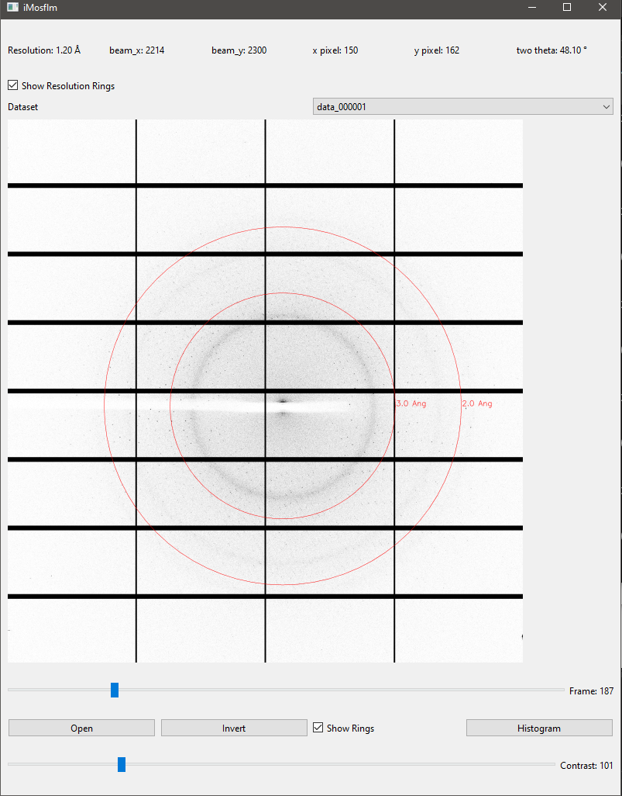

# pymosflm

**Python port of the famous crystallographic application**

`pymosflm` is an experimental Python-based implementation inspired by **MOSFLM**, designed for handling crystallographic diffraction images. It currently supports opening and visualizing **CBF** and **HDF5** files, though performance optimizations are still in progress.



## Features
- Load and display **CBF** and **HDF5**, **TIFF** crystallographic images (most images actually, e.g. **JPEG**, **PNG**, etc. ...).
- Basic image contrast adjustments.
- Interactive visualization with PySide6.
- Support for resolution ring overlays.

## Installation

Ensure you have Python 3.9+ installed, then clone the repository and install dependencies:

```sh
# Clone the repository
git clone https://github.com/markxbrooks/pymosflm.git
cd pymosflm

# Install dependencies
pip install -r requirements.txt
```

## Usage

Run the GUI with:

```sh
python imosflm/qtmosflm.py
```

You can open diffraction images in **CBF** or **HDF5** format using the open button.

## Roadmap
- Improve **HDF5** file loading speed.
- Implement basic crystallographic **data processing**.
- Add support for additional image formats like **TIFF**.
- Enhance **UI/UX** with better contrast controls and histogram equalization.
- Enable integration with existing crystallographic software pipelines.


This project is in active development—stay tuned for updates!

### Dependencies
Ensure you have the following dependencies installed:

- Python 3.8+
- `numpy`
- `h5py`
- `fabio`
- `matplotlib`
- `pycbf` (optional, for enhanced CBF handling)

You can install the required dependencies using:
```sh
pip install numpy h5py fabio matplotlib
```

## Usage

To open a crystallographic file:
```python
from pymosflm import loader

image = loader.open_file("example.cbf")
image.show()
```

For HDF5 files:
```python
image = loader.open_file("example.h5")
image.show()
```

## Roadmap

- **Improve file loading speed**: Optimize handling of large HDF5 datasets.
- **Implement data processing**: Integrate data reduction and processing capabilities.
- **GUI support**: Add a graphical interface for visualization and processing.
- **Additional format support**: Expand support for other crystallographic formats.

## Contributions

Contributions are welcome! Feel free to submit issues, feature requests, or pull requests.

## License

`pymosflm` is released under the MIT License.


